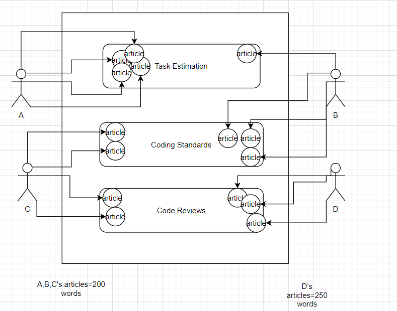

# ProjectPlan

## Overview

The project has been divided up in terms of articles, and a coresponding wordcount per article, that each team member will contribute. Each team meber will be responsible for contributing roughly 750 words. Where Each team member will independently search for ways to replace sections of their word count with diagrams and examples to ensure that the handbook is easy to scan over.

Each topic will contain 1000 words and must be contributed too by at least two team members.
Too achieve this we will be implementing the following strategy:

Person A(Connor Byrne) will be responsible for finding 4 articles on the topic of Task Estimation, and writting a total of 800 word on the topic.

Person B (James Redmond) will contribute 1 article towards Task Estimation and write 200 words on the topic (bringing the total up to 1000 words). They will then find 3 articles on the topic of coding standards, and contribute 600 words on the topic to the handbook.

Person C (Gabriel Lupu) will finish the Coding Standards topic by contributing 2 articles and 400 words. They will then contribute 2 articles to the Code Reviews topic, and write 125 words per article for a total of 250.

Finaly Person D (Amnah Alfailakawi) will contribute fewer articles (3) but a higher word count per article (250) to bring the total for the Code Reviews section up to 1000 words.

## Task List

### General Tasks

1. ~~Create GitHub Repository.~~

2. ~~Formulate strategy for project completion.~~

3. ~~Divide work evenly between team members.~~

4. ~~Write up project plan~~

### Person A Tasks

1. Find 4 articles pertaining to the topic of Task Estimation.

2. Write 800 words on the topic.

3. Find diagrams that can be included to make topic more scanable.

### Person B Tasks

1. Find 1 article on the topic of Task Estimation.

2. Write 200 words on the topic.

3. Find diagrams that can be included to make topic more scanable.

4. Find 3 articles on the topic of Coding Standards.

5. Write 600 words on the topic.

6. Find diagrams that can be included to make topic more scanable.

### Person C Tasks

1. Find 2 articles on the topic of Coding Standards.

2. Write 400 words on the topic.

3. Find diagrams that can be included to make topic more scanable.

4. Find 2 article on the topic of Code Reviews .

5. Write 250 words on the topic.

6. Find diagrams that can be included to make topic more scanable.

### Person D Tasks

1. Find 3 articles on the topic of Code Reviews.

2. Write 750 words on the topic.

3. Find diagrams that can be included to make topic more scanable.
